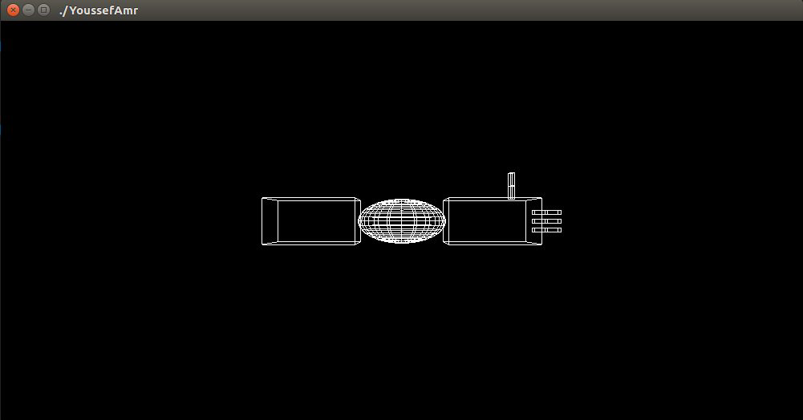

# Robotic Arm


## Arm Image


## Added Code
1. Code for fingers(2,3)
   ```//Draw fingerbase flang 2
     glPushMatrix();
     glTranslatef(1.0, 0.0, 0.2);
     glRotatef((GLfloat)fingerBase, 0.0, 0.0, 1.0);
     glTranslatef(0.15, 0.0, 0.0);
     glPushMatrix();
     glScalef(0.3, 0.1, 0.1);
     glutWireCube(1);
     glPopMatrix();
     //Draw finger flang 2
     glTranslatef(0.15, 0.0, 0.0);
     glRotatef((GLfloat)fingerUp, 0.0, 0.0, 1.0);
     glTranslatef(0.15, 0.0, 0.0);
     glPushMatrix();
     glScalef(0.3, 0.1, 0.1);
     glutWireCube(1);
     glPopMatrix();
     glPopMatrix(); ```

#### All added fingers are the same except the fourth finger
2. Code for fingers(4)
   ``` //Draw fingerbase flang 4
   glPushMatrix();
   glTranslatef(0.5, -0.0, -0.5);
   glRotatef((GLfloat)fingerBase, 0.0, 0.0, 1.0);
   glRotatef(90,0.0,1.0,0.0);
   glTranslatef(0.15, 0.0, 0.0);
   glPushMatrix();
   glScalef(0.3, 0.1, 0.1);
   glutWireCube(1);
   glPopMatrix();
   //Draw finger flang 4
   glTranslatef(0.15, 0.0, 0.0);
   glRotatef((GLfloat)fingerUp, 0.0, 0.0, 1.0);
   glTranslatef(0.15, 0.0, 0.0);
   glPushMatrix();
   glScalef(0.3, 0.1, 0.1);
   glutWireCube(1);
   glPopMatrix();
   glPopMatrix();

#### I added a sphere between shoulder and elbow
3.Code for sphere
   ```glTranslatef (1.0, 0.0, 0.0);
   glRotatef ((GLfloat) elbow, 0.0, 0.0, 1.0);
   glTranslatef (1.0, 0.0, 0.0);
   //Draw ball
   glPushMatrix();
   glScalef (2.0, 1.0, 1.0);
   glutWireSphere (0.5,20,16);
   glPopMatrix();


